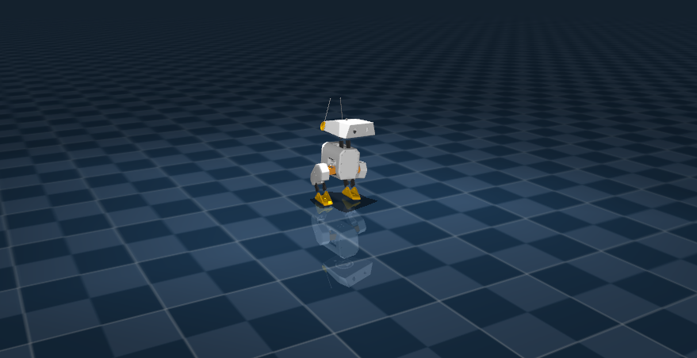

:github_url: https://github.com/ros-controls/ros2_control_demos/blob/{REPOS_FILE_BRANCH}/example_18/doc/userdoc.rst

.. _ros2_control_demos_example_18_userdoc:

ros2_control_demo_example_18
================================

This demo runs a policy-driven `Open Duck Mini v2 <https://github.com/apirrone/Open_Duck_Mini/tree/v2/mini_bdx/robots/open_duck_mini_v2>`_ in MuJoCo, using ONNX inference for locomotion and streaming observations via ``state_interfaces_broadcaster``.

You need: mujoco_ros2_control, ONNX Runtime, a trained ONNX model, and ROS 2 (tested on Jazzy).

Robot description
------------------

The demo uses URDF, MuJoCo XML models, and ros2_control configuration from ``description/``.

* The meshes come from `Open_Duck_Mini <https://github.com/apirrone/Open_Duck_Mini/tree/v2/mini_bdx/robots/open_duck_mini_v2>`__.
* The MuJoCo model (open_duck_mini_v2.xml, scene.xml) is adapted from * Open_Duck_Playground with BAM-tuned actuator parameters.

A custom hardware interface adds foot contact detection via ``mjData->contact[]``.

See `description/README.md <https://github.com/ros-controls/ros2_control_demos/tree/{REPOS_FILE_BRANCH}/example_18/description/README.md>`_ for sources, structure, and modifications.

Prerequisites
-------------

Dependencies
~~~~~~~~~~~~

This demo requires `mujoco_ros2_control <https://github.com/ros-controls/mujoco_ros2_control>`_ and a custom hardware interface (``DuckMiniMujocoSystemInterface``) that adds foot contact detection. Follow the mujoco_ros2_control installation instructions for your ROS 2 distro.

ONNX Runtime
~~~~~~~~~~~~

.. code-block:: bash

   wget https://github.com/microsoft/onnxruntime/releases/download/v1.23.2/onnxruntime-linux-x64-1.23.2.tgz
   tar -xzf onnxruntime-linux-x64-1.23.2.tgz
   sudo cp -r onnxruntime-linux-x64-1.23.2/include/* /usr/local/include/
   sudo cp -r onnxruntime-linux-x64-1.23.2/lib/* /usr/local/lib/
   sudo ldconfig

If the library is not found after install:

.. code-block:: bash

   # find where the library is extracted
   find ~ -name "onnxruntime-linux-x64-*" -type d 2>/dev/null

   # copy to the right location
   sudo cp -r /pathto_extracted_library/onnxruntime-linux-x64-1.23.2/include/* /usr/local/include/
   sudo cp -r /pathto_extracted_library/onnxruntime-linux-x64-1.23.2/lib/* /usr/local/lib/
   sudo ldconfig

   # Verify library and headers
   ls -l /usr/local/lib/libonnxruntime.so*
   ls -l /usr/local/include/onnxruntime_cxx_api.h

Model and workspace
~~~~~~~~~~~~~~~~~~~

The ONNX model from ``model_path`` in ``bringup/config/open_duck_mini_controllers.yaml`` (Default: ``onnx_model/open_duck_mini_policy.onnx``) will be used. There are several options:

* ``onnx_model/open_duck_mini_policy.onnx``: The bundled model was trained via `Open_Duck_Playground <https://github.com/apirrone/Open_Duck_Playground>`_ for MuJoCo-to-MuJoCo+ros2_control transfer. we have validated the model trained in MuJoCo via Python reference (direct ONNX inference in MuJoCo) walks forward successfully.
* A custom policy. Place your ONNX model in ``onnx_model/``, then build and source your ROS 2 workspace before running.

   * You can use a baseline model from `Open_Duck_Mini <https://github.com/apirrone/Open_Duck_Mini>`_ (e.g. ``BEST_WALK_ONNX_2.onnx``).
   * If you want to create your own: clone `Open_Duck_Playground <https://github.com/apirrone/Open_Duck_Playground>`_, run ``uv run playground/open_duck_mini_v2/runner.py``. The ``policy_params_fn`` in ``playground/common/runner.py`` exports ONNX at each checkpoint.

Build
-----

1. Clone and build mujoco_ros2_control (TODO: update once mujoco_ros2_control is released, e.g. apt/rosdep install):

.. code-block:: bash

   cd ~/ros2_ws/src
   git clone https://github.com/ros-controls/mujoco_ros2_control.git
   cd ~/ros2_ws
   colcon build --symlink-install --packages-select mujoco_ros2_control
   source install/setup.bash

2. Build example_18:

.. code-block:: bash

   cd ~/ros2_ws
   colcon build --symlink-install --packages-select ros2_control_demo_example_18
   source install/setup.bash

3. (Optional) Verify the URDF in RViz:

.. code-block:: bash

   ros2 launch ros2_control_demo_example_18 view_robot.launch.py gui:=true

Run
---

.. code-block:: bash

   ros2 launch ros2_control_demo_example_18 example_18_mujoco.launch.py

In another terminal (source your workspace first):

.. code-block:: bash

   ros2 control list_controllers
   python3 $(ros2 pkg prefix ros2_control_demo_example_18)/share/ros2_control_demo_example_18/launch/test_motions.py

The test script publishes ``VelocityCommandWithHead`` messages (base_velocity + head_commands) to ``/motion_controller/cmd_velocity_with_head`` at 50 Hz. You should see the duck walk forward.

Timing: 0.002s sim timestep in ``scene.xml``, 50 Hz controller. Each control update spans 10 simulation steps, matching the reference training setup.

Design overview
---------------

At a high level, the demo uses the following control structure.

* Control pipeline: (1) Observation formatter — sensor data (IMU, joint states, velocity commands, foot contacts) into the model's observation vector; (2) ONNX inference — policy outputs raw actions; (3) Action formatter — scale, clamp to joint limits, rate limit, then write to hardware.

* Data flow: MuJoCo → hardware interface (joint states, IMU, contact sensors) → state_interfaces_broadcaster → ``/state_interfaces_broadcaster/values`` → MotionController (subscribes and runs ONNX) → command interfaces → hardware → MuJoCo. User commands: ``/motion_controller/cmd_velocity_with_head`` (VelocityCommandWithHead: base_velocity + head_commands).

* Hardware: ``DuckMiniMujocoSystemInterface`` adds foot contact detection via ``mjData->contact[]``; sensors with ``mujoco_type="contact"`` expose ``contact_raw``. MuJoCo model uses BAM-tuned actuator parameters and built-in position actuators.

* Observation vector (matches training): gyro, accelerometer, velocity commands (7D), joint positions/velocities, last three actions, motor targets, feet contacts (2), imitation phase (cos/sin). Total size 17 + 6*N (N=14). Imitation phase must match training (e.g. period 27 steps).

ONNX integration
----------------

MotionController uses ONNX Runtime to turn the observation vector into joint commands. The observation (floats) is wrapped into an ``Ort::Value`` tensor and passed to the ONNX session, which returns an output tensor. The model outputs relative joint positions as floats; these are converted to doubles, then ActionProcessor scales them by ``action_scale`` (default 0.25), adds default joint positions, and sends the resulting absolute positions to the hardware. Default positions are taken from the first sensor read, or from ``default_joint_positions`` in the controller configuration.

Current Limitations
-------------------
Occasionally, the robot may fall over. Further model fine-tuning or domain randomization can help improve robustness.
