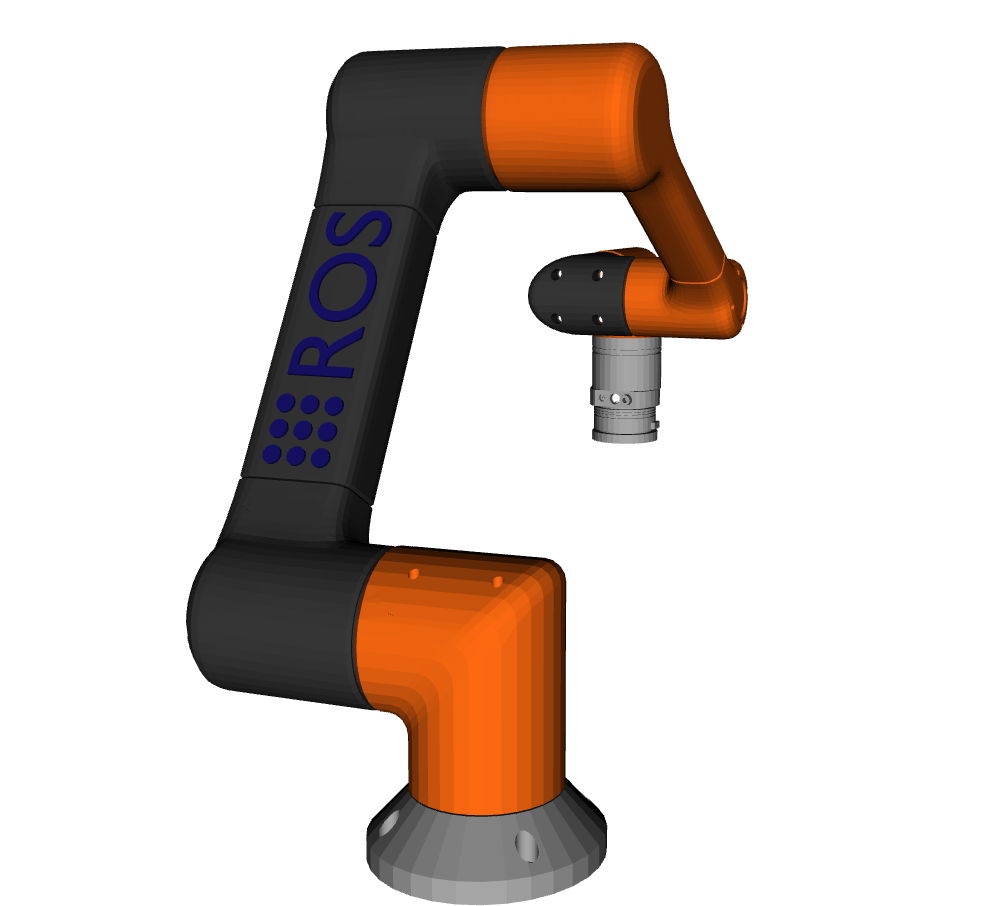
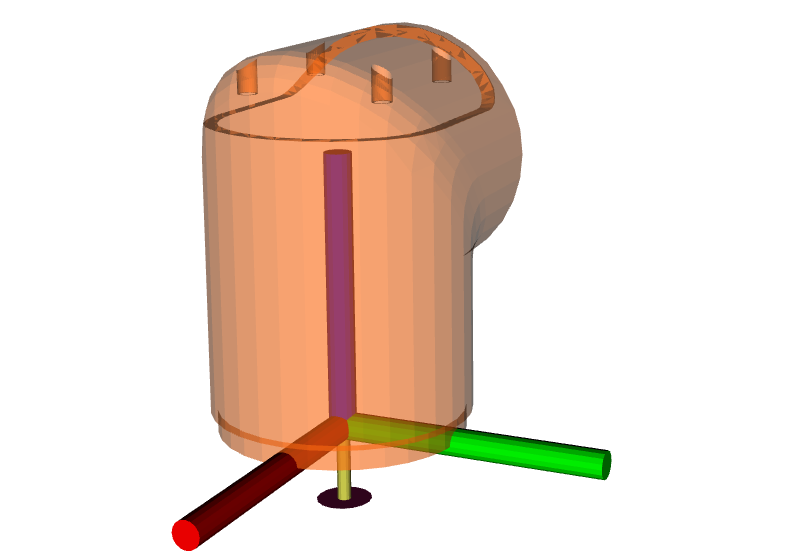
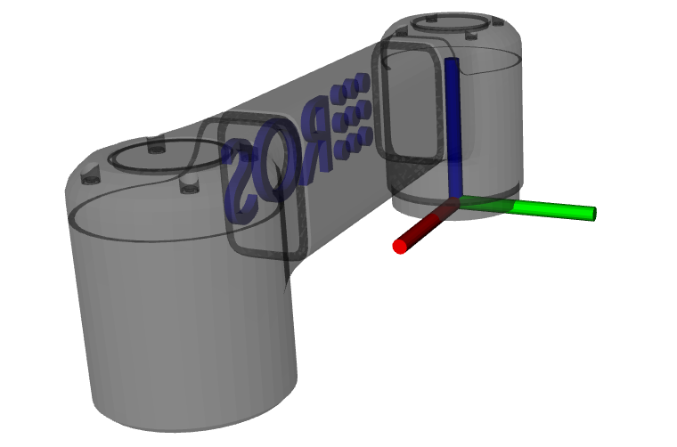
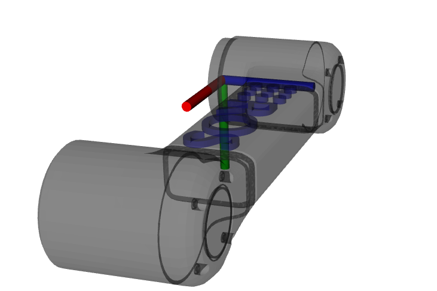
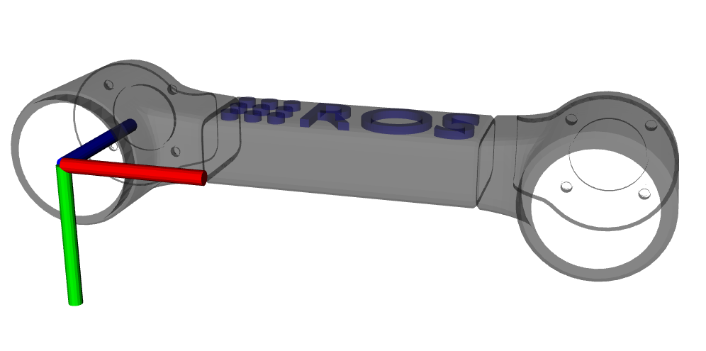
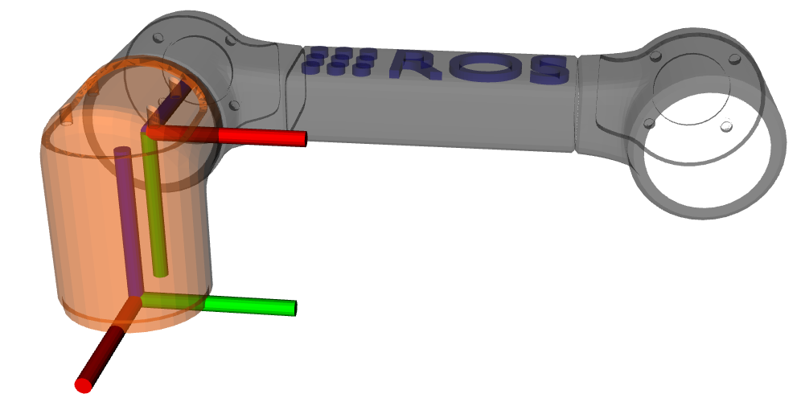
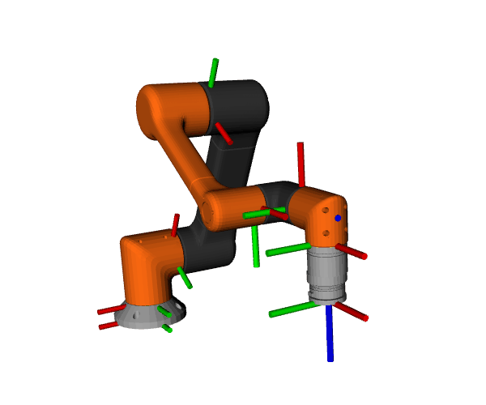

:github_url: https://github.com/ros-controls/ros2_control_demos/blob/{REPOS_FILE_BRANCH}/example_7/doc/userdoc.rst

.. _ros2_control_demos_example_7_userdoc:

Example 7: Full tutorial with a 6DOF robot
==========================================

ros2_control is a realtime control framework designed for general robotics applications. Standard c++ interfaces exist for interacting with hardware and querying user defined controller commands. These interfaces enhance code modularity and robot agnostic design. Application specific details, e.g. what controller to use, how many joints a robot has and their kinematic structure, are specified via YAML parameter configuration files and a Universal Robot Description File (URDF). Finally, the ros2_control framework is deployed via ROS 2 launch a file.

This tutorial will address each component of ros2_control in detail, namely:

1. ros2_control overview
2. Writing a URDF
3. Writing a hardware interface
4. Writing a controller

ros2_control overview
--------------------------

ros2_control introduces ``state_interfaces`` and ``command_interfaces`` to abstract hardware interfacing. The ``state_interfaces`` are read only data handles that generally represent sensors readings, e.g. joint encoder. The ``command_interfaces`` are read and write data handles that hardware commands, like setting a joint velocity reference. The ``command_interfaces`` are exclusively accessed, meaning if a controller has "claimed" an interface, it cannot be used by any other controller until it is released. Both interface types are uniquely designated with a name and type. The names and types for all available state and command interfaces are specified in a YAML configuration file and a URDF file.

ros2_control provides the ``ControllerInterface`` and ``HardwareInterface`` classes for robot agnostic control. During initialization, controllers request ``state_interfaces`` and ``command_interfaces`` required for operation through the ``ControllerInterface``. On the other hand, hardware drivers offer ``state_interfaces`` and ``command_interfaces`` via the ``HardwareInterface``. ros2_control ensure all requested interfaces are available before starting the controllers. The interface pattern allows vendors to write hardware specific drivers that are loaded at runtime.

The main program is a realtime read, update, write loop. During the  read call, hardware drivers that conform to ``HardwareInterface`` update their offered ``state_interfaces`` with the newest values received from the hardware. During the update call, controllers calculate commands from the updated ``state_interfaces`` and writes them into its ``command_interfaces``. Finally, during to write call, the hardware drivers read values from their offer ``command_interfaces`` and send them to the hardware. The ``ros2_control`` node runs the main loop a realtime thread. The ``ros2_control`` node runs a second non-realtime thread to interact with ROS publishers, subscribers, and services.

Writing a URDF
--------------------------

The URDF file is a standard XML based file used to describe characteristic of a robot. It can represent any robot with a tree structure, except those with cycles. Each link must have only one parent. For ros2_control, there are three primary tags: ``link``, ``joint``, and ``ros2_control``. The ``joint`` tag define the robot's kinematic structure, while the ``link`` tag defines the dynamic properties and 3D geometry. The ``ros2_control`` defines the hardware and controller configuration.

Geometry
************

Most commercial robots already have ``robot_description`` packages defined, see the `Universal Robots <https://github.com/UniversalRobots/Universal_Robots_ROS2_Description>`__ for an example. However, this tutorial will go through the details of creating one from scratch.

First, we need a 3D model of our robot. For illustration, a generic 6 DOF robot manipulator will be used.

  a generic 6 DOF robot manipulator

The robot's 6 links each need to be processed and exported to their own ``.stl`` and ``.dae`` files. Generally, the ``.stl`` 3D model files are coarse meshes used for fast collision checking, while the ``.dae`` files are used for visualization purposed only. We will use the same mesh in our case for simplicity.

By convention, each ``.stl`` file expresses the position its vertices in its own reference frame. Hence, we need to specify the linear transformation (rotation and translation) between each link to define the robot's full geometry. The 3D model for each link should be adjusted such that the proximal joint axis (the axis that connects the link to its parent) is in the z-axis direction. The 3D model's origin should also be adjusted such that the bottom face of the mesh is co-planer with the xy-plane. The following mesh illustrates this configuration.

  Link 1

  Link 2 aligned

Each mesh should be exported to its own file after processing them. `Blender <https://www.blender.org/>`__ is an open source 3D modeling software, which can import/export ``.stl`` and ``.dae`` files and manipulate their vertices. Blender was used to process the robot model in this tutorial.

We can finally calculate the transforms between the robot's joints and begin writing the URDF. First, apply a negative 90 degree roll to link 2 in its frame.

  Link 2 with -90 degree roll

To keep the example simple, we will not apply a pitch now. Then, we apply a positive 90 degree yaw.

  Link 2 with -90 degree roll and 90 degree yaw

Finally, we apply a translation of -0.1 meters in the x-axis and 0.18 meters in the z-axis between the link 2 and link 1 frame. The final result is shown below.

  Link 2 with -90 degree roll, 90 degree yaw, and translation

The described process is then repeated for all links.

URDF file
************

The URDF file is generally formatted according to the following template.

.. code-block:: xml

  <robot name="robot_6_dof">
    <!-- create link fixed to the "world" -->
    <link name="base_link">
      <visual>
        <origin rpy="0 0 0" xyz="0 0 0"/>
        <geometry>
          <mesh filename="package://robot_6_dof/meshes/visual/link_0.dae"/>
        </geometry>
      </visual>
      <collision>
        <origin rpy="0 0 0" xyz="0 0 0"/>
        <geometry>
          <mesh filename="package://robot_6_dof/meshes/collision/link_0.stl"/>
        </geometry>
      </collision>
      <inertial>
        <mass value="1"/>
        <inertia ixx="1.0" ixy="0.0" ixz="0.0" iyy="1.0" iyz="0.0" izz="1.0"/>
      </inertial>
    </link>
    <!-- additional links ... -->
    <link name="world"/>
    <link name="tool0"/>
    <joint name="base_joint" type="fixed">
      <parent link="world"/>
      <child link="base_link"/>
      <origin rpy="0 0 0" xyz="0 0 0"/>
      <axis xyz="0 0 1"/>
    </joint>
    <!-- joints - main serial chain -->
    <joint name="joint_1" type="revolute">
      <parent link="base_link"/>
      <child link="link_1"/>
      <origin rpy="0 0 0" xyz="0 0 0.061584"/>
      <axis xyz="0 0 1"/>
      <limit effort="1000.0" lower="-3.141592653589793" upper="3.141592653589793" velocity="2.5"/>
    </joint>
    <!-- additional joints ... -->
    <!-- ros2 control tag -->
    <ros2_control name="robot_6_dof" type="system">
      <hardware>
        <plugin>
          <!-- {Name_Space}/{Class_Name}-->
        </plugin>
      </hardware>
      <joint name="joint_1">
        <command_interface name="position">
          <param name="min">{-2*pi}</param>
          <param name="max">{2*pi}</param>
        </command_interface>
        <!-- additional command interfaces ... -->
        <state_interface name="position">
          <param name="initial_value">0.0</param>
        </state_interface>
        <!-- additional state interfaces ... -->
      </joint>
      <!-- additional joints ...-->
      <!-- additional hardware/sensors ...-->
    </ros2_control>
  </robot>

* The ``robot`` tag encloses all contents of the URDF file. It has a name attribute which must be specified.
* The ``link`` tag defines the robot's geometry and inertia properties. It has a name attribute which will be referred to by the ``joint`` tags.
* The ``visual`` tag specifies the rotation and translation of the visual mesh. If the meshes were process as described previously, then the ``origin`` tag can be left at all zeros.
* The ``geometry`` and ``mesh`` tags specify the location of the 3D mesh file relative to a specified ROS 2 package.
* The ``collision`` tag is equivalent to the ``visual`` tag, except the specified mesh is used for collision checking in some applications.
* The ``inertial`` tag specifies mass and inertia for the link. The origin tag specifies the link's center of mass. These values are used to calculate forward and inverse dynamics. Since our application does not use dynamics, uniform arbitrary values are used.
* The ``<!-- additional links ... -->`` comments indicates that many consecutive ``link`` tags will be defined, one for each link.
* The ``<link name="world"/>`` and ``<link name="tool0"/>`` elements are not required. However, it is convention to set the link at the tip of the robot to  tool0 and to define the robot's base link relative to a world frame.
* The ``joint`` tag specifies the kinematic structure of the robot. It has two required attributes: name and type. The type specifies the viable motion between the two connected links. The subsequent ``parent`` and ``child`` links specify which two links are joined by the joint.
* The ``axis`` tag species the joint's degree of freedom. If the meshes were process as described previously, then the axis value is always ``"0 0 1"``.
* The ``limits`` tag specifies kinematic and dynamics limits for the joint.
* The ``ros2_control`` tag specifies hardware configuration of the  robot. More specifically, the available state and command interfaces. The tag has two required attributes: name and type. Additional elements, such as sensors, are also included in this tag.
* The ``hardware`` and ``plugin`` tags instruct the ros2_control framework to dynamically load a hardware driver conforming to ``HardwareInterface`` as a plugin. The plugin is specified as ``<{Name_Space}/{Class_Name}``.
* Finally, the ``joint`` tag specifies the state and command interfaces that the loaded plugins will offer. The joint is specified with the name attribute. The ``command_interface`` and ``state_interface`` tags specify the interface type, usually position, velocity, acceleration, or effort.

To simplify the URDF file, ``xacro`` is used to define macros, see `this tutorial <https://docs.ros.org/en/{DISTRO}/Tutorials/Intermediate/URDF/Using-Xacro-to-Clean-Up-a-URDF-File.html>`__. The complete xacro file for the robot in this tutorial is available `here <https://github.com/ros-controls/ros2_control_demos/tree/{REPOS_FILE_BRANCH}/example_7/description/urdf/r6bot.urdf.xacro>`__. To verify the kinematic chain, the tool ``urdf_to_graphviz`` can be used after the URDF is generated by ``xacro``. Running

.. code-block:: bash

  xacro description/urdf/r6bot.urdf.xacro > r6bot.urdf
  urdf_to_graphviz r6bot.urdf r6bot

generates ``r6bot.pdf``, showing the kinematic chain of the robot.

Writing a hardware interface
-----------------------------

In ros2_control, hardware system components are integrated via user defined driver plugins that conform to the ``HardwareInterface`` public interface. Hardware plugins specified in the URDF are dynamically loaded during initialization using the pluginlib interface. In order to run the ``ros2_control_node``, a parameter named ``robot_description`` must be set. This normally done in the ros2_control launch file.

The following code blocks will explain the requirements for writing a new hardware interface.

The hardware plugin for the tutorial robot is a class called ``RobotSystem`` that inherits from  ``hardware_interface::SystemInterface``. The ``SystemInterface`` is one of the offered hardware interfaces designed for a complete robot system. For example, The UR5 uses this interface. The ``RobotSystem`` must implement five public methods.

1. ``on_init``
2. ``export_state_interfaces``
3. ``export_command_interfaces``
4. ``read``
5. ``write``

.. code-block:: c++

  using CallbackReturn = rclcpp_lifecycle::node_interfaces::LifecycleNodeInterface::CallbackReturn;
  #include "hardware_interface/types/hardware_interface_return_values.hpp"

  class HARDWARE_INTERFACE_PUBLIC RobotSystem : public hardware_interface::SystemInterface {
      public:
      CallbackReturn on_init(const hardware_interface::HardwareInfo &info) override;
      std::vector<hardware_interface::StateInterface> export_state_interfaces() override;
      std::vector<hardware_interface::CommandInterface> export_command_interfaces() override;
      return_type read(const rclcpp::Time &time, const rclcpp::Duration &period) override;
      return_type write(const rclcpp::Time & /*time*/, const rclcpp::Duration & /*period*/) override;
      // private members
      // ...
  }

The ``on_init`` method is called once during ros2_control initialization if the ``RobotSystem`` was specified in the URDF. In this method, communication between the robot hardware needs to be setup and memory dynamic should be allocated. Since the tutorial robot is simulated, explicit communication will not be established. Instead, vectors will be initialized that represent the state all the hardware, e.g. a vector of doubles describing joint angles, etc.

.. code-block:: c++

  CallbackReturn RobotSystem::on_init(const hardware_interface::HardwareInfo &info) {
      if (hardware_interface::SystemInterface::on_init(info) != CallbackReturn::SUCCESS) {
          return CallbackReturn::ERROR;
      }
      // setup communication with robot hardware
      // ...
      return CallbackReturn::SUCCESS;
  }

Notably, the behavior of ``on_init`` is expected to vary depending on the URDF file. The ``SystemInterface::on_init(info)`` call fills out the ``info`` object with specifics from the URDF. For example, the ``info`` object has fields for joints, sensors, gpios, and more. Suppose the sensor field has a name value of ``tcp_force_torque_sensor``. Then the ``on_init`` must try to establish communication with that sensor. If it fails, then an error value is returned.

Next, ``export_state_interfaces`` and ``export_command_interfaces`` methods are called in succession. The ``export_state_interfaces`` method returns a vector of ``StateInterface``, describing the ``state_interfaces`` for each joint. The ``StateInterface`` objects are read only data handles. Their constructors require an interface name, interface type, and a pointer to a double data value. For the ``RobotSystem``, the data pointers reference class member variables. This way, the data can be access from every method.

.. code-block:: c++

  std::vector<hardware_interface::StateInterface> RobotSystem::export_state_interfaces() {
      std::vector<hardware_interface::StateInterface> state_interfaces;
      // add state interfaces to ``state_interfaces`` for each joint, e.g. `info_.joints[0].state_interfaces_`, `info_.joints[1].state_interfaces_`, `info_.joints[2].state_interfaces_` ...
      // ...
      return state_interfaces;
    }

The ``export_command_interfaces`` method is nearly identical to the previous one. The difference is that a vector of ``CommandInterface`` is returned. The vector contains objects describing the ``command_interfaces`` for each joint.

.. code-block:: c++

  std::vector<hardware_interface::CommandInterface> RobotSystem::export_command_interfaces() {
      std::vector<hardware_interface::CommandInterface> command_interfaces;
      // add command interfaces to ``command_interfaces`` for each joint, e.g. `info_.joints[0].command_interfaces_`, `info_.joints[1].command_interfaces_`, `info_.joints[2].command_interfaces_` ...
      // ...
      return command_interfaces;
  }

The ``read`` method is core method in the ros2_control loop. During the main loop, ros2_control loops over all hardware components and calls the ``read`` method. It is executed on the realtime thread, hence the method must obey by realtime constraints. The ``read`` method is responsible for updating the data values of the ``state_interfaces``. Since the data value point to class member variables, those values can be filled with their corresponding sensor values, which will in turn update the values of each exported ``StateInterface`` object.

.. code-block:: c++

  return_type RobotSystem::read(const rclcpp::Time & time, const rclcpp::Duration &period) {
      // read hardware values for state interfaces, e.g joint encoders and sensor readings
      // ...
      return return_type::OK;
  }

The ``write`` method is another core method in the ros2_control loop. It is called after ``update`` in the realtime loop. For this reason, it must also obey by realtime constraints. The ``write`` method is responsible for updating the data values of the ``command_interfaces``. As opposed to ``read``, ``write`` accesses data values pointer to by the exported ``CommandInterface`` objects sends them to the corresponding hardware. For example, if the hardware supports setting a joint velocity via TCP, then this method accesses data of the corresponding ``command_interface`` and sends a packet with the value.

.. code-block:: c++

  return_type write(const rclcpp::Time & time, const rclcpp::Duration & period) {
      // send command interface values to hardware, e.g joint set joint velocity
      // ...
      return return_type::OK;
  }

Finally, all ros2_control plugins should have the following two lines of code at the end of the file.

.. code-block:: c++

  #include "pluginlib/class_list_macros.hpp"

  PLUGINLIB_EXPORT_CLASS(robot_6_dof_hardware::RobotSystem, hardware_interface::SystemInterface)

``PLUGINLIB_EXPORT_CLASS`` is a c++ macro creates a plugin library using ``pluginlib``.

Plugin description file (hardware)
**********************************

The plugin description file is a required XML file that describes a plugin's library name, class type, namespace, description, and interface type. This file allows the ROS 2 to automatically discover and load plugins. It is formatted as follows.

.. code-block:: xml

  <library path="{Library_Name}">
    <class
      name="{Namespace}/{Class_Name}"
      type="{Namespace}::{Class_Name}"
      base_class_type="hardware_interface::SystemInterface">
    <description>
      {Human readable description}
    </description>
    </class>
  </library>

The ``path`` attribute of the ``library`` tags refers to the cmake library name of the user defined hardware plugin. See `here <https://github.com/ros-controls/ros2_control_demos/tree/{REPOS_FILE_BRANCH}/example_7/ros2_control_demo_example_7.xml>`__ for the complete XML file.

CMake library (hardware)
************************

The general CMake template to make a hardware plugin available in ros2_control is shown below. Notice that a library is created using the plugin source code just like any other  cmake library. In addition, an extra compile definition and cmake export macro (``pluginlib_export_plugin_description_file``) need to be added. See `here <https://github.com/ros-controls/ros2_control_demos/tree/{REPOS_FILE_BRANCH}/example_7/CMakeLists.txt>`__ for the complete ``CMakeLists.txt`` file.

.. code-block:: cmake

  add_library(
      robot_6_dof_hardware
      SHARED
      src/robot_hardware.cpp
  )

.. # include and link dependencies
.. # ...

.. # Causes the visibility macros to use dllexport rather than dllimport, which is appropriate when building the dll but not consuming it.
.. target_compile_definitions(robot_6_dof_hardware PRIVATE "HARDWARE_PLUGIN_DLL")
.. # export plugin
.. pluginlib_export_plugin_description_file(robot_6_dof_hardware hardware_plugin_plugin_description.xml)
.. # install libraries
.. # ...

Writing a controller
--------------------------

In ros2_control, controllers are implemented as plugins that conforms to the ``ControllerInterface`` public interface. Similar to the hardware interfaces, the controller plugins to load are specified using ROS parameters. This is normally  achieved by passing a YAML parameter file to the ``ros2_control_node``. Unlike hardware interfaces, controllers exists in a finite set of states:

1. Unconfigured
2. Inactive
3. Active
4. Finalized

Certain interface methods are called during transitions between these states. During the main control loop, the controller is in the active state.

The following code blocks will explain the requirements for writing a new controller.

The controller plugin for the tutorial robot is a class called ``RobotController`` that inherits from  ``controller_interface::ControllerInterface``. The ``RobotController`` must implement nine public methods. The last six are `managed node <https://design.ros2.org/articles/node_lifecycle.html>`__  transitions callbacks.

1. ``command_interface_configuration``
2. ``state_interface_configuration``
3. ``update``
4. ``on_configure``
5. ``on_activate``
6. ``on_deactivate``
7. ``on_cleanup``
8. ``on_error``
9. ``on_shutdown``

.. code-block:: c++

  class RobotController : public controller_interface::ControllerInterface {
      public:
      controller_interface::InterfaceConfiguration command_interface_configuration() const override;
      controller_interface::InterfaceConfiguration state_interface_configuration() const override;
      controller_interface::return_type update(const rclcpp::Time &time, const rclcpp::Duration &period) override;
      controller_interface::CallbackReturn on_init() override;
      controller_interface::CallbackReturn on_configure(const rclcpp_lifecycle::State &previous_state) override;
      controller_interface::CallbackReturn on_activate(const rclcpp_lifecycle::State &previous_state) override;
      controller_interface::CallbackReturn on_deactivate(const rclcpp_lifecycle::State &previous_state) override;
      controller_interface::CallbackReturn on_cleanup(const rclcpp_lifecycle::State &previous_state) override;
      controller_interface::CallbackReturn on_error(const rclcpp_lifecycle::State &previous_state) override;
      controller_interface::CallbackReturn on_shutdown(const rclcpp_lifecycle::State &previous_state) override;
  // private members
  // ...
  }

The ``on_init`` method is called immediately after the controller plugin is dynamically loaded. The method is called only once during the lifetime for the controller, hence memory that exists for the lifetime of the controller should be allocated. Additionally, the parameter values for ``joints``, ``command_interfaces`` and ``state_interfaces`` should be declared and accessed. Those parameter values are required for the next two methods.

.. code-block:: c++

  using CallbackReturn = rclcpp_lifecycle::node_interfaces::LifecycleNodeInterface::CallbackReturn;

  controller_interface::CallbackReturn on_init(){
      // declare and get parameters needed for controller initialization
      // allocate memory that will exist for the life of the controller
      // ...
      return CallbackReturn::SUCCESS;
  }

The ``on_configure`` method is called immediately after the controller is set to the inactive state. This state occurs when the controller is started for the first time, but also when it is restarted. Reconfigurable parameters should be read in this method. Additionally, publishers and subscribers should be created.

.. code-block:: c++

  controller_interface::CallbackReturn on_configure(const rclcpp_lifecycle::State &previous_state){
      // declare and get parameters needed for controller operations
      // setup realtime buffers, ROS publishers, and ROS subscribers
      // ...
    return CallbackReturn::SUCCESS;
  }

The ``command_interface_configuration``  method is called after ``on_configure``. The method returns a list of ``InterfaceConfiguration`` objects to indicate which command interfaces the controller needs to operate. The command interfaces are uniquely identified by their name and interface type. If a requested interface is not offered by a loaded hardware interface, then the controller will fail.

.. code-block:: c++

  controller_interface::InterfaceConfiguration command_interface_configuration(){
      controller_interface::InterfaceConfiguration conf;
      // add required command interface to `conf` by specifying their names and interface types.
      // ..
      return conf
  }

The ``state_interface_configuration`` method is then called, which is similar to the last method. The difference is that  a list of ``InterfaceConfiguration`` objects representing the required state interfaces to operate is returned.

.. code-block:: c++

  controller_interface::InterfaceConfiguration state_interface_configuration() {
      controller_interface::InterfaceConfiguration conf;
      // add required state interface to `conf` by specifying their names and interface types.
      // ..
      return conf
  }

The ``on_activate`` is called once when the controller is activated. This method should handle controller restarts, such as setting the resetting reference to safe values. It should also perform controller specific safety checks. The ``command_interface_configuration`` and ``state_interface_configuration`` methods are also called again when the controller is activated.

.. code-block:: c++

  controller_interface::CallbackReturn on_activate(const rclcpp_lifecycle::State &previous_state){
    // Handle controller restarts and dynamic parameter updating
    // ...
    return CallbackReturn::SUCCESS;
  }

The ``update`` method is part of the main control loop. Since the method is part of the realtime control loop, the realtime constraint must be enforced. The controller should read from its state interfaces, read its reference and calculate a control output. Normally, the reference is accessed via a ROS 2 subscriber. Since the subscriber runs on the non-realtime thread, a realtime buffer is used to a transfer the message to the realtime thread. The realtime buffer is eventually a pointer to a ROS message with a mutex that guarantees thread safety and that the realtime thread is never blocked. The calculated control output should then be written to the command interface, which will in turn control the hardware.

.. code-block:: c++

  controller_interface::return_type update(const rclcpp::Time &time, const rclcpp::Duration &period){
    // Read controller inputs values from state interfaces
    // Calculate controller output values and write them to command interfaces
    // ...
    return controller_interface::return_type::OK;
  }

The ``on_deactivate`` is called when a controller stops running. It is important to release the claimed command interface in this method, so other controllers can use them if needed. This is down with the ``release_interfaces`` function.

.. code-block:: c++

  controller_interface::CallbackReturn on_deactivate(const rclcpp_lifecycle::State &previous_state){
      release_interfaces();
      // The controller should be properly shutdown during this
      // ...
      return CallbackReturn::SUCCESS;
  }

The ``on_cleanup`` and ``on_shutdown`` are called when the controller's lifecycle node is transitioning to shutting down. Freeing any allocated memory and general cleanup should be done in these methods.

.. code-block:: c++

  controller_interface::CallbackReturn on_cleanup(const rclcpp_lifecycle::State &previous_state){
    // Callback function for cleanup transition
    // ...
    return CallbackReturn::SUCCESS;
  }

.. code-block:: c++

  controller_interface::CallbackReturn on_shutdown(const rclcpp_lifecycle::State &previous_state){
    // Callback function for shutdown transition
    // ...
    return CallbackReturn::SUCCESS;
  }

The ``on_error`` method is called if the managed node fails a state transition. This should generally never happen.

.. code-block:: c++

  controller_interface::CallbackReturn on_error(const rclcpp_lifecycle::State &previous_state){
    // Callback function for erroneous transition
    // ...
    return CallbackReturn::SUCCESS;
  }

Plugin description file (controller)
************************************

The plugin description file is again required for the controller, since it is exported as a library. The controller plugin description file is formatted as follows. See `here <https://github.com/ros-controls/ros2_control_demos/tree/{REPOS_FILE_BRANCH}/example_7/ros2_control_demo_example_7.xml>`__ for the complete XML file.

.. code-block:: xml

  <library path="{Library_Name}">
    <class
      name="{Namespace}/{Class_Name}"
      type="{Namespace}::{Class_Name}"
      base_class_type="controller_interface::ControllerInterface">
    <description>
      {Human readable description}
    </description>
    </class>
  </library>

CMake library (controller)
**************************

The plugin must be specified in the CMake file that builds the controller plugin. See `here <https://github.com/ros-controls/ros2_control_demos/tree/{REPOS_FILE_BRANCH}/example_7/CMakeLists.txt>`__ for the complete ``CMakeLists.txt`` file.

.. code-block:: cmake

  add_library(
      r6bot_controller
      SHARED
      src/robot_controller.cpp
  )

.. # include and link dependencies
.. # ...

.. # Causes the visibility macros to use dllexport rather than dllimport, which is appropriate when building the dll but not consuming it.
.. target_compile_definitions(r6bot_controller PRIVATE "CONTROLLER_PLUGIN_DLL")
.. # export plugin
.. pluginlib_export_plugin_description_file(r6bot_controller robot_6_dof_controller_plugin_description.xml)
.. # install libraries
.. # ...

Launching the example
--------------------------

The full tutorial example can be run by first building the workspace.

.. code-block:: shell

  git clone -b {REPOS_FILE_BRANCH} https://github.com/ros-controls/ros2_control_demos.git
  cd ros2_control_demos
  colcon build --symlink-install
  source install/setup.bash

To view the robot, open a terminal and launch the ``view_r6bot.launch.py`` file from the ``ros2_control_demo_example_7`` package.

.. code-block:: shell

  ros2 launch ros2_control_demo_example_7 view_r6bot.launch.py

With the ``joint_state_publisher_gui`` you can now change the position of every joint.

Next, kill the process in the launch file and start the simulation of the controlled robot.
Open a terminal and launch the ``r6bot_controller.launch.py`` file from the ``ros2_control_demo_example_7`` package.

.. code-block:: shell

  ros2 launch ros2_control_demo_example_7 r6bot_controller.launch.py

Finally, open a new  terminal and run the following command.

.. code-block:: shell

  ros2 launch ros2_control_demo_example_7 send_trajectory.launch.py

You should see the tutorial robot making a circular motion in RViz.

  Trajectory following example.
